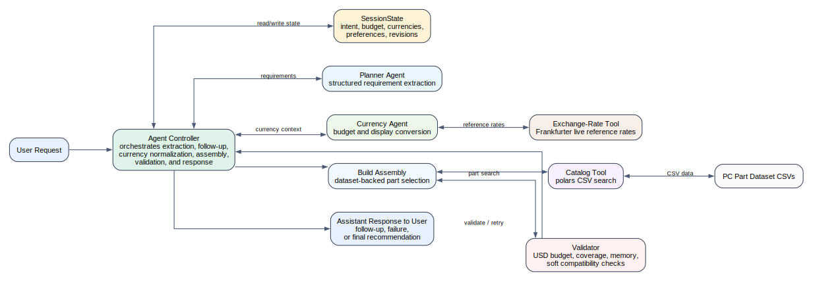

# Agentic PC Build Assistant

Agentic PC Build Assistant is a two-agent PC recommendation system that recommends either full custom desktop builds or single hardware parts from a local CSV dataset. The planner agent handles requirement extraction, catalog-driven selection, validation, and response generation, while the currency agent normalizes non-USD budgets and applies live reference currency conversion. The system validates budget and compatibility-related constraints where the dataset allows it, and it returns explicit warnings where checks are partial. This repository is structured to work both as a GitHub project and as a course submission artifact with observable behavior through the script, notebook, and agent traces.

GitHub repository: [gour6380/Agentic-PC-Build-Assistant](https://github.com/gour6380/Agentic-PC-Build-Assistant)

## Features

- Full custom PC build recommendations
- Single-part recommendations
- Follow-up questions for missing constraints
- Budget-band handling
- CSV-backed catalog search with `polars`
- Validation and retry loop
- Live reference currency conversion
- Observable trace output and warnings

## Architecture Overview

The system uses two cooperating agents plus deterministic tools. The planner agent extracts structured requirements, assembles candidate builds from the local catalog, and produces the final response. The currency agent detects non-USD requests, resolves live reference exchange rates, and normalizes budgets for planning. `SessionState` carries request context, revisions, budget metadata, and currency context across turns. A catalog tool searches the local CSV dataset, and a validator checks budget, category coverage, and compatibility-related constraints before the final response is returned.



The standalone architecture image artifact is [architecture_diagram.svg](architecture_diagram.svg).

## Repository Structure

- `agentic_system.py`
- `agentic_system.ipynb`
- `pc_build_agent/`
- `download.py`
- `Agentic_AI_System_Design_Report.pdf`
- `Agentic_AI_Systems_Analysis_Report.pdf`
- `module_summary.pdf`
- `architecture_diagram.svg`
- `data/pc_part_dataset/`

## Requirements

- macOS-tested project
- Python `3.13`
- Local virtual environment expected at `env/`
- Network access required for OpenAI model calls
- Network access required for live exchange-rate lookup
- Local CSV dataset stored in `data/pc_part_dataset/`

## Setup

1. Create and activate a Python 3.13 virtual environment if needed.

```bash
python3.13 -m venv env
source env/bin/activate
```

2. Install dependencies with `pip install -r requirements.txt`.

```bash
env/bin/python -m pip install -r requirements.txt
```

3. After downloading or cloning the repo from GitHub, rename `.env.example` to `.env`, then open `.env` and replace the placeholder values with your real credentials.

```bash
mv .env.example .env
```

```env
OPENAI_API_KEY=your_key_here
OPENAI_BASE_URL=https://openai.vocareum.com/v1
OPENAI_MODEL=gpt-4.1-mini
```

4. Ensure the dataset exists in `data/pc_part_dataset/`.

5. If the dataset is missing, run `python download.py`.

```bash
env/bin/python download.py
```

## Usage

One-shot request:

```bash
env/bin/python agentic_system.py --message "Recommend a GPU under $400 for 1440p gaming."
```

Demo mode:

```bash
env/bin/python agentic_system.py --demo
```

Interactive mode:

```bash
env/bin/python agentic_system.py
```

Dataset download:

```bash
env/bin/python download.py
```

Optional custom dataset output directory:

```bash
env/bin/python download.py --output-dir data/pc_part_dataset
```

The notebook artifact is [agentic_system.ipynb](agentic_system.ipynb) and already contains stored outputs and traces from representative runs.

## Example Prompts

- `Build me a gaming PC around $1500 with WiFi and 32 GB RAM.`
- `Build me a gaming PC around 120000 rupees with WiFi and 32 GB RAM.`
- `Recommend a GPU under $400 for 1440p gaming.`
- `I need a custom PC for video editing.`

## Submission Artifacts

- Script artifact: `agentic_system.py`
- Notebook artifact: `agentic_system.ipynb`
- Report PDFs: `Agentic_AI_System_Design_Report.pdf`, `module_summary.pdf` and `Agentic_AI_Systems_Analysis_Report.pdf`
- Architecture diagram: `architecture_diagram.svg`

The notebook and `--demo` mode both expose observable outputs, actions, decisions, and traces for review.

## Limitations and Risks

- Recommendations are dataset-bound and limited to the local CSV files
- The system does not invent hardware outside the CSV dataset
- CPU socket inference is a soft check because socket values are incomplete in the CPU data
- GPU fit, cooler clearance, storage lanes, and full PSU sizing are not fully verified
- Live currency conversion is informational and may differ from payment-provider rates
- Exchange-rate behavior depends on the live provider being available

## Data Source

- Based on CSV data from `docyx/pc-part-dataset`
- Prices are treated as USD source prices

## Notes

- This project was built as an agentic AI system assignment
- Behavior is observable through terminal traces and notebook outputs
- The report contains the deeper design and ethics discussion
